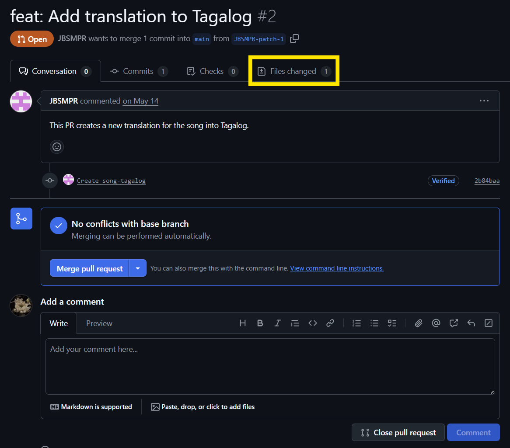
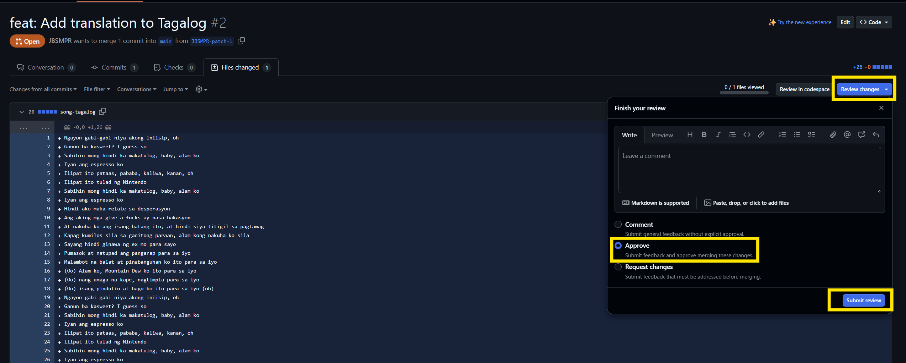
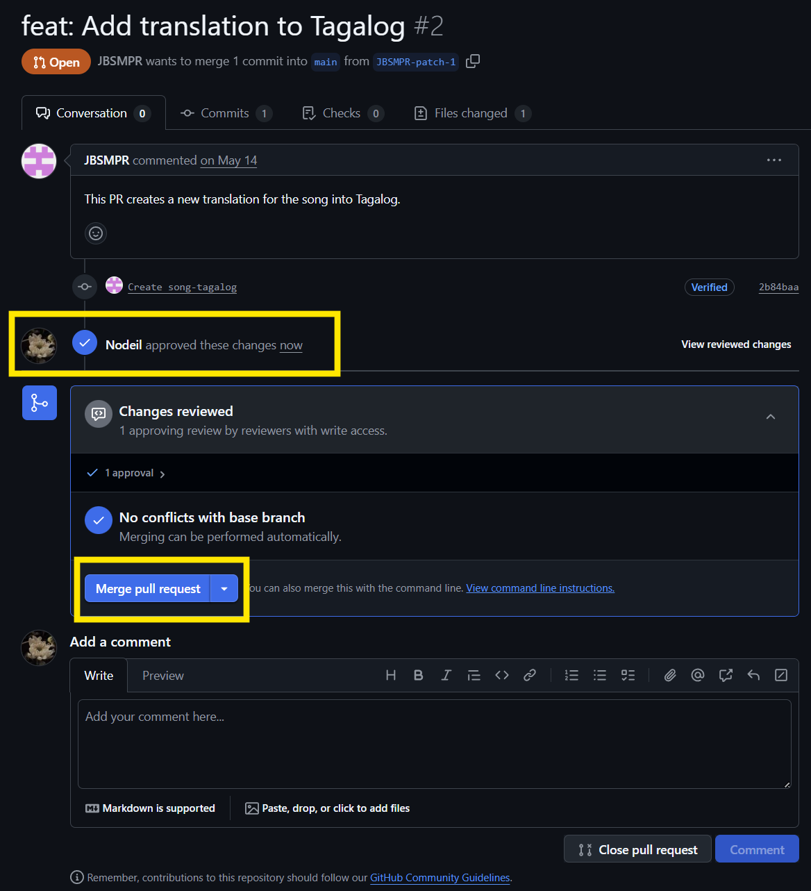

# DTP Assignment 2

This assignment is all about GitHub. It is divided into two parts.

## Part 1: Sing A New Song
You will have to put song lyrics in `src/song.txt` and push it to your repository. The text must have greater than **20 non-empty lines**, including the title. Feel free to use your favorite songs.

> [!NOTE]
> Since the repository is generated publicly, it will be visible to other DTP participants.

## Part 2: Tongues of Fire
You will have to contribute one pull request to at least **three (3)** of your fellow participants' repositories. Possible contribution includes adding lines/lyrics to the song, translating part/all of the lyrics or fixing another person's translation of the text. As much as possible, let's choose repositories that have the fewest pull requests thus far to keep things even.

> [!NOTE]
> Note that a pull request is only counted as your contribution when merged by the owner of the repository.

## Reminders on Approving Pull Requests 
As much as possible, don't merge pull requests immediately, as code review is also part of the activity. Instead: 

1. Go to the Files Changed tab of the pull request.

2. If there are any comments against the PR, submit them as a Request changes review, otherwise use an Approve review.

3. Once the code review is submitted, then you can merge the Pull Request.
